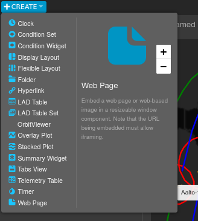
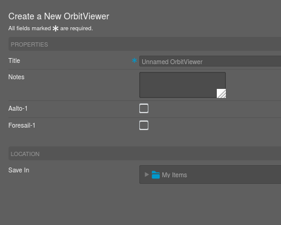
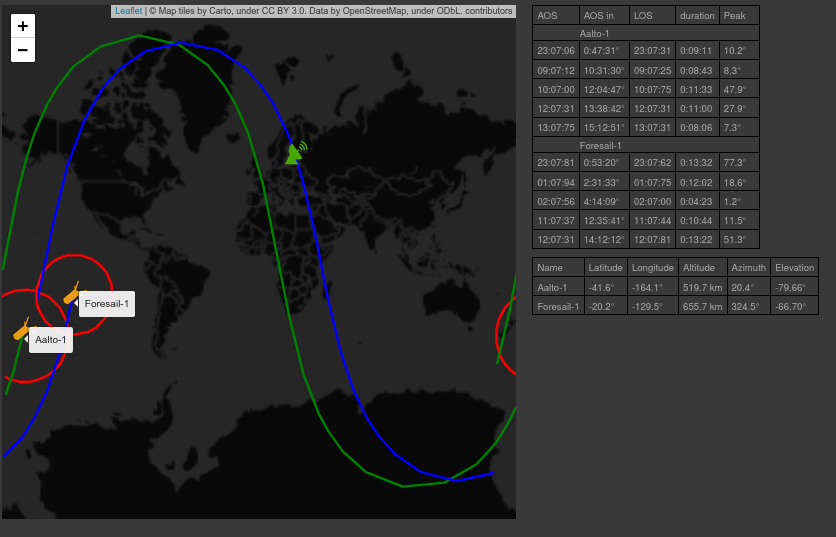

## Satellite orbit viewer for  OpenMCT.


This is a plugin for the OpenMCT framework that can be used to track satellite orbits and their upcoming passes (*acquisition of signal* (AOS), *loss of signal* (LOS), and *peak elevation*) by using TLEs. The computations are carried out by the TLE.js+satellite.js, and the orbits are visualized with the leaflet. The user is expected to have a source (e.g., remote server) from which the TLEs can be requested.

### Package used:

**Leaflet:**  https://leafletjs.com/

**tle.js:** https://github.com/davidcalhoun/tle.js/

**moment.js:** https://momentjs.com/

#### How to build:

Browserify http://browserify.org/ required

```bash
npm install     //Only once
npm run build
```

#### How to use


This instruction applies to the current version that has no package in the npm registry.

First, you will need to have working OpenMCT: https://github.com/nasa/openmct after of which you can use the plugin by adding following lines to your index.html header


```html
<script type="module" src="PATH_TO/orbitViewer.js"></script>
```

 and

```javascript
openmct.install(orbitViewer.OrbitViewerPlugin());
```

before the line

```javascript
 openmct.start();
```

Now when the website is running, there will be an option to create OrbitViewer in the Create menu



Choosing to create OrbitViewer, there will an option to choose which satellites to track



If the requested TLE's are received, the screen with a following view will open.

  

  The view visualizes the orbits, satellites, visibility area, and the ground station. On the right, information about the next five upcoming passes of each satellite are displayed and also some current information about the satellites.

  The view interacts with the OpenMCT's time conductors, which can be used to control the time (Local clock and Fixed Timespan mode). It is important to know that TLEs are only accurate at a time, so don't expect good accuracy if applied beyond one day.  It is also good to know that the time conductor might have a +5 min offset, which will be applied to the orbit simulation.


#### Features

- View orbits of the multiple satellites
- Display passes of the multiple satellites
- Display orbits at the given time (requires time conductor)
- Easy to deploy to Heroku with containers
- F5 required if can not connect to the TLE server

#### How it is structured:

The plugin can be configured during installation by passing a dictionary to the plugin's constructor.

```javascript
openmct.install(orbitViewer.OrbitViewerPlugin({
                                   					url="wss://my_url:777"   
                                         	}));
```

These values will overwrite the values from the **config.json**

**config.json**

```json
{
	//Where the TLEs can be requested and received
    "url" : "wss://test123openmct.herokuapp.com/",

	//What kind of objects can be tracked
	//Each must have unique name. Icon and color path must be provided
	//More objects can be added by adding elements to this dictionary
    "trackables" : {
      "Aalto-1" : {
          "icon": "./icons/fs.png",
          "pathColor" : "green"
      },
      "Foresail-1" : {
        "icon": "./icons/fs.png",
        "pathColor" : "blue"
      }
    },
	//Which map tiling service is used. Remember to give attribution too if required
    "map" : {
      "mapTiles" : "https://cartodb-basemaps-{s}.global.ssl.fastly.net/dark_all/{z}/{x}/{y}.png",
      "attribution" : "Map tiles by Carto, under CC BY 3.0. Data by OpenStreetMap, under ODbL."
    },

	//Ground station. Only one is currently supported. Elevation (km) is the 			//elevation from the water level and visibility (degrees) of the radar
	//from the horizon
    "groundStation" : {
      "icon" : "./icons/gs.png",
      "position" : [60.32452, 24.968544],
      "elevation" : 0,
      "visibility" : 0
    },


    "timings" : {
    	//How often in milliseconds the TLE's are updated
        "TLEUpdateInterval" : 3600000,
        //How often the markes on the screen are updated
        "updateMarkersInterval" : 2000
    }

}
```

The default setup has websocket wrapper which can be overwritten by supplying the plugin's constructor a different wrapper

```javascript
openmct.install(orbitViewer.OrbitViewerPlugin({
                                   					url="wss://my_url:777"   
                                         	}, mySocketWrapper()));
```

 The wrapper must have functions

```javascript
connect(url)				//Connects to url and adds listeners
sendMessage(url, message)	//Sends messages to the url and returns promise
							//that after a resolve will contain the message from 								//the server
```

**request message to the server**

```
message = {"exchange" : "tracking",
			"method" : "request",
			"params" : [{SATELLITE_NAME, TRACKED(bool)},...}]}
```

**response from the server**

```json
result : {
	trackables :[{
		name : "NAME",
        tle1 : "TLE 1st row",
        tle2 : "TLE 2nd row"
	}]
}
```

The message structure might seem overly complicated, but the messages were designed to work with another plugin that will be released later.

**Code structure**

-orbitViewer.js || Some OpenMCT structures.

- websocketWrapper.js || Wrapper for the socket handler
- LeafletMapView.js  || Contains draw calls and update loops. This is a mess currently, refactoring scheduled soon. CSS styling should be separated
  - orbitSolver || Data and logics.

-server.js || Simple webserver for testing

#### Running dev environment:

File ./index.html contains an example of how to run simple setup on localhost:8080. For TLE server see ./simpleHTTP/.

```bash
npm install     //Only once
npm run build; npm start
```

#### Notes:

The plugin does not support "fixed timespan" mode. Use "Local Clock" always.

#### ToDo:

- Need CSS wizard to fix the look of the view
- Collision warning
- Test what happens in a case of geostationary orbits
- Test phones
- Hide the links under the name
- Make npm registry ready version
